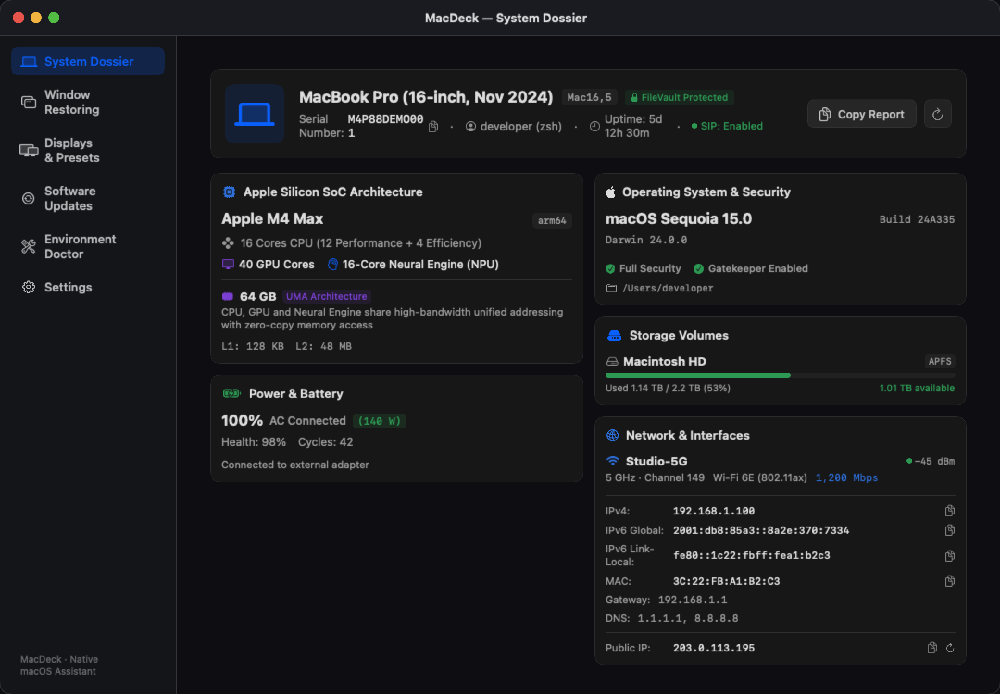
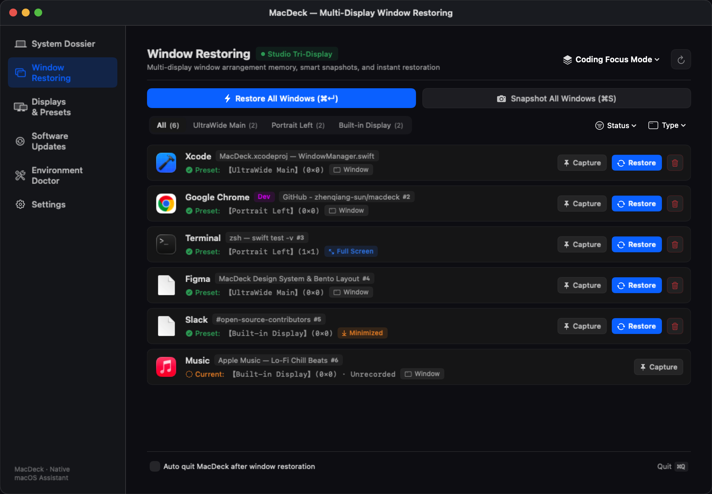

<div align="center">


# 🎛️ MacDeck

**The Native Multi-Display Window Restorer, Apple Silicon Dossier & Developer Toolkit for macOS**

[](https://apple.com/macos)
[](https://swift.org)
[](LICENSE)
[-purple)](Package.swift)
[](#)

[English](README.md) • [简体中文](README_CN.md)

<br/>



</div>

---

## 💡 Why MacDeck?

If you are a developer, designer, or power user who frequently connects/disconnects external monitors, wakes your Mac from sleep, or manages multiple development toolchains, you have likely encountered these frustrations:

- **Window Chaos on Reconnect**: Connecting an external monitor or waking from sleep compresses your windows onto the primary display, forcing you to rearrange them every single time.
- **Commercial Tool Inconvenience**: Existing window memorizers are pricey, lack active maintenance, break on macOS Fullscreen Spaces, or fail to differentiate between Google Chrome multi-profile windows.
- **System Bloat & Subscription Traps**: Cleaning utilities and monitoring tools are often bulky Electron apps that hog hundreds of megabytes of RAM and demand expensive yearly subscriptions.

**MacDeck was built to solve this.** Built purely with **Swift 6 + SwiftUI + AppKit**, it is an ultra-lightweight, native macOS assistant running with near-zero background footprint.

---

## ✨ Key Features

### 1. 🖥️ Intelligent Multi-Display Topology & Window Restoration
- **Two-Tier Architecture**: Organizes windows by **Physical Display Topology** (e.g., *Quad Workspace*, *Mobile Single*) and customizable **Window Presets** (*Coding Mode*, *Research Mode*).
- **Fullscreen Space In-Place Retention**: Automatically identifies macOS Spaces via SkyLight private frameworks, restoring fullscreen and minimized windows without animation stutter or accidental fullscreen exits.
- **Multi-Profile Chrome Support**: Distinguishes between separate Google Chrome profile windows (Personal, Work, Sandbox).
- **Hardware-Aware Display Aliasing**: Assigns persistent aliases (e.g., *UltraWide Main*, *Portrait Left*) to your monitors that gracefully adapt even when hardware UUIDs shift.
- **Zero-Background Footprint Option**: Automatically terminates the app once window restoration completes (`⌘↵`), preserving system memory.

<p align="center">
  
</p>

### 2. 📊 Apple Silicon Bento System Dossier
- **Hardware Topology & UMA**: Displays Apple Silicon heterogenous core configurations (Performance vs. Efficiency cores), GPU cores, Neural Engine capability, cache sizes, and unified memory bandwidth.
- **Power & Battery Health**: Reports cycle counts, maximum capacity degradation, and external power source details.
- **Clean APFS Storage Breakdown**: Accurately shows internal physical solid-state drives while filtering out false 100%-full SMB/NFS network shares and temporary disk images.
- **Multi-Source Racing Public IP Probe**: Queries 6 global high-availability CDN nodes concurrently (`icanhazip`, `ident.me`, `ipinfo`, `ipip`, `ip.sb`) with zero UI freezing, completing in under 300ms.

### 3. 🩺 Developer Environment Doctor & Safe Cleaner
- **Comprehensive CLI Ecosystem Health Checks**: Automatically diagnoses `Homebrew` (`brew doctor`), `Xcode Command Line Tools`, `Docker`, `Node.js / npm`, `Rust / Cargo`, `Pipx`, and `Volta`.
- **Intelligent Cache Reclaim**: Previews cleanable caches and safely frees up gigabytes of build artifacts with live interactive terminal diagnostic logs.

### 4. 📦 Multi-Source Package Update Hub
- **Aggregated CLI Package Management**: One-click detection for outdated packages across Homebrew, Cargo, npm global, Pipx, and Volta.
- **Granular Control**: Supports version pinning, version ignoring, single/batch upgrades, and transaction rollback history.

---

## 🚀 Installation & Quick Start

### Method 1: Direct Download (Recommended)
Download the latest `MacDeck-v1.x.x.dmg` from [GitHub Releases](https://github.com/zhenqiang-sun/macdeck/releases), open it, and drag `MacDeck.app` to your `/Applications` folder.

> [!NOTE]
> As MacDeck is an independently signed open-source app, macOS Gatekeeper may prompt on first launch (*"MacDeck cannot be opened because Apple cannot check it for malicious software"*). To bypass, run this single line in Terminal:
> ```bash
> xattr -cr /Applications/MacDeck.app
> ```

### Method 2: Homebrew Cask (Coming Soon)
```bash
brew install --cask macdeck
```

### Method 3: Build from Source
```bash
git clone https://github.com/zhenqiang-sun/macdeck.git
cd macdeck
./scripts/build_app.sh
```

---

## ⌨️ Shortcuts & Hotkeys

| Shortcut | Action |
| :--- | :--- |
| `⌘ + Return` | Trigger One-Click Window Restoration for the active preset |
| `⌘ + S` | Snapshot current desktop window layout into the active preset |
| `⌘ + Q` | Quit MacDeck |

---

## 🔒 Privacy & Security

MacDeck respects your privacy and operates under strict security standards:
- **Zero Tracking & Analytics**: No telemetry, no third-party tracking SDKs, no cloud servers.
- **Accessibility Transparency**: Accessibility permissions are used strictly to query and reposition window geometry on user demand. No keystrokes or screen contents are ever read or transmitted.
- **Pure Local Operation**: All configuration files are stored locally in plain JSON at `~/.config/macdeck/`.

---

## 🛠️ Tech Stack & Architecture

- **Language**: Swift 6.0 (Concurrency: `async/await`, `TaskGroup`, `nonisolated`, `@MainActor`)
- **UI Framework**: SwiftUI + AppKit
- **Design System**: Native Bento Grid with macOS Dynamic Dark/Light Mode
- **Zero Third-Party Dependencies**: Built entirely upon native macOS SDKs

---

## 🤝 Contributing

Contributions are welcome! Please feel free to check out our [Contributing Guidelines](CONTRIBUTING.md) to get started.

---

## 📄 License

MacDeck is open-source software licensed under the [GNU General Public License v3.0 (GPL-3.0)](LICENSE).
