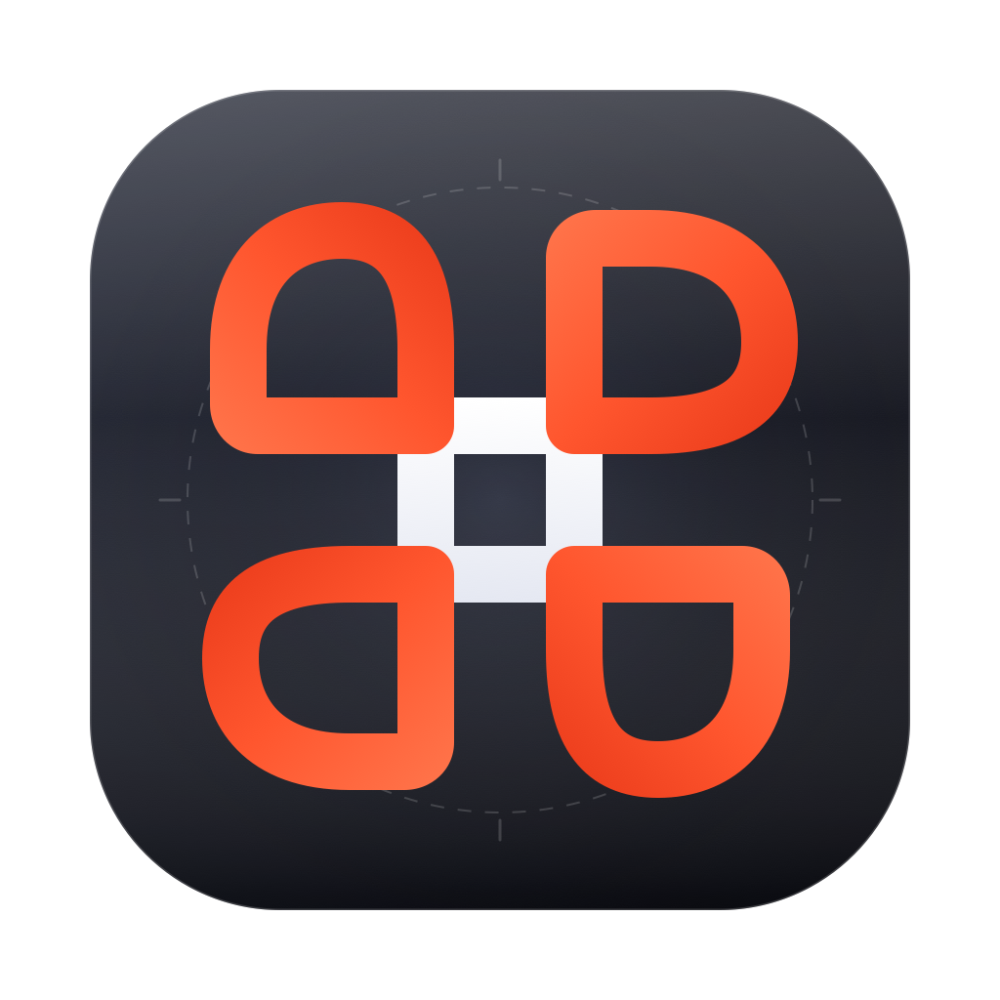
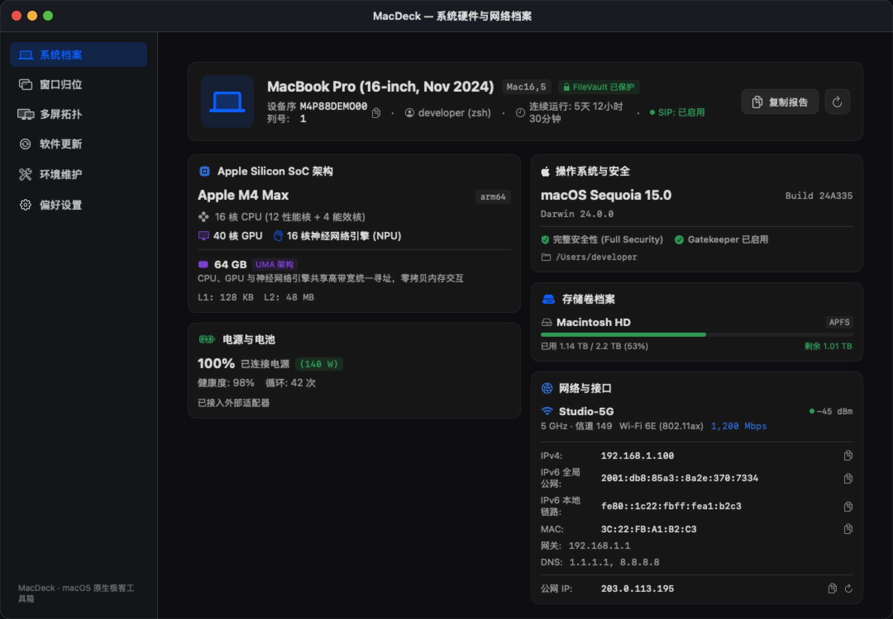
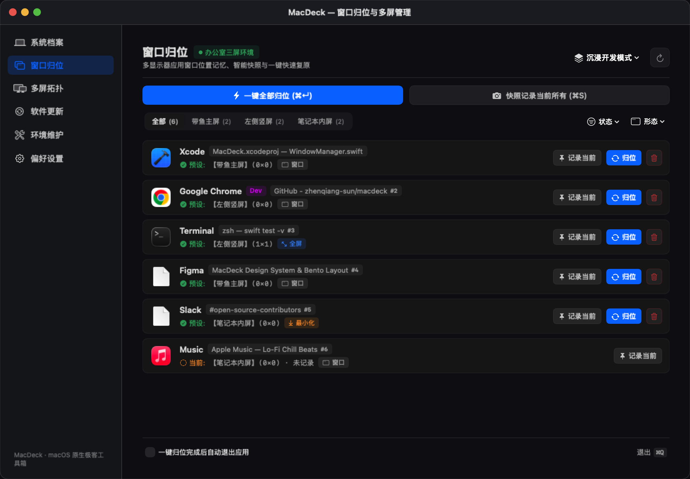

<div align="center">



# 🎛️ MacDeck

**专为 macOS 打造的原生多屏窗口归位、Apple Silicon 硬件档案与开发生态维护工具箱**

[](https://apple.com/macos)
[](https://swift.org)
[](LICENSE)
[-purple)](Package.swift)
[](#)

[English](README.md) • [简体中文](README_CN.md)

<br/>



</div>

---

## 💡 为什么需要 MacDeck？

如果你是一名程序员、独立开发者或深度 Mac 用户，频繁拔插外接扩展坞、在多屏之间切换、或维护繁杂的开发环境时，你一定遇到过这些痛点：

- **外接屏拔插或休眠唤醒后窗口全挤在一块**：每次重新连接显示器，所有打开的 IDE、终端、浏览器全乱成一团，被迫花大量时间重新拖拽排布；
- **现有商业工具臃肿昂贵或水土不服**：老牌窗口记忆工具多年不更新、遇到全屏 Space 就闪退或失效、无法区分 Chrome 多用户 Profile；
- **系统清理工具充满商业绑架**：动辄几百兆的 Electron 软件常驻内存，还有昂贵的年费订阅。

**MacDeck 应运而生。** 采用纯原生 **Swift 6 + SwiftUI + AppKit** 打造，零第三方臃肿依赖，常驻内存仅几十兆，提供极致轻盈的极客操作体验。

---

## ✨ 核心特性

### 1. 🖥️ 多屏物理拓扑感知与智能窗口一键归位
- **双层架构设计**：以**物理硬件拓扑环境**（如“工作四屏”、“便携单屏”）为基石，环境内自由创建多种**窗口布局方案**（如“沉浸开发模式”、“写作模式”）；
- **全屏 Space 深度保护**：借助底层 SkyLight 机制，准确感知全屏窗口所在屏幕，原地就绪避免退出动画闪烁，单次点击 100% 稳固归位；
- **Chrome 多 Profile 智能区分**：精准识别同一个 Chrome 下的不同用户会话（个人、工作、沙盒），分窗归位绝不错乱；
- **显示器别名硬件漫游**：可给屏幕赋予直观别名（如“带鱼主屏”、“左侧竖屏”），即便硬件 UUID 变化也能自愈识别；
- **归位后自动退出选项**：点击归位或按下 `⌘↵` 完成后，应用可自动终止退出，做到真正的**零后台驻留**。

<p align="center">
  
</p>

### 2. 📊 Apple Silicon Bento 硬件与网络深度档案
- **异构芯片与统一内存全景**：展示 CPU 性能核/能效核配比、GPU 核心数、神经网络引擎（NPE）、高速缓存与统一内存带宽；
- **电池健康与电源状态**：直观展示电池循环计数、最大健康容量衰减与外接供电瓦数；
- **纯净 APFS 物理存储**：精准统计内部固态硬盘容量，自动过滤虚拟镜像与容易误判满盘的网络 SMB/NFS 挂载；
- **多源并发竞速公网 IP 探测**：并发向 6 个全球顶级 CDN 节点（Cloudflare icanhazip、ident.me、ipinfo、IPIP 等）发起竞速，300 毫秒内瞬间呈现公网出口 IP，支持一键刷新。

### 3. 🩺 开发者环境体检与安全清理
- **全方位 CLI 生态体检**：一键扫描诊断 `Homebrew` (`brew doctor`)、`Xcode Command Line Tools`、`Docker`、`Node.js`、`Rust / Cargo`、`Pipx` 与 `Volta`；
- **安全可控的缓存清理**：精准定位各语言环境构建缓存，支持清理预览与实时终端交互输出。

### 4. 📦 多源软件包生态更新
- **统一聚合多包管理器**：一键扫描并批量更新 Homebrew、Cargo、npm 全局包、Pipx 与 Volta；
- **精细化控制**：支持版本锁定（Pin）、单版本忽略、安全升级与事务历史回滚。

---

## 🚀 安装与快速开始

### 方式一：直接下载安装（推荐）
从 [GitHub Releases](https://github.com/zhenqiang-sun/macdeck/releases) 下载最新的 `MacDeck-v1.x.x.dmg`，双击打开并拖动至 `/Applications` 文件夹。

> [!NOTE]
> 由于 MacDeck 是独立开源应用，首次打开可能会出现 macOS 门禁拦截（*“无法打开 MacDeck，因为 Apple 无法检查其是否包含恶意软件”*）。只需在终端运行这一行命令即可安全放行：
> ```bash
> xattr -cr /Applications/MacDeck.app
> ```

### 方式二：Homebrew Cask 一键安装（即将支持）
```bash
brew install --cask macdeck
```

### 方式三：源码本地编译
```bash
git clone https://github.com/zhenqiang-sun/macdeck.git
cd macdeck
./scripts/build_app.sh
```

---

## ⌨️ 快捷键指南

| 快捷键 | 功能 |
| :--- | :--- |
| `⌘ + Return` | 触发当前方案全部窗口一键归位 |
| `⌘ + S` | 快照保存当前桌面所有窗口布局至当前方案 |
| `⌘ + Q` | 退出 MacDeck |

---

## 🔒 隐私与安全承诺

MacDeck 坚守纯粹开源极客原则：
- **零数据上报与分析**：绝无任何统计分析 SDK，不上传任何用户数据；
- **权限公开透明**：仅在用户显式触发时通过 Accessibility 权限计算和定位窗口位置，绝不监听击键或记录屏幕；
- **纯本地配置**：所有配置明文保存在本地 `~/.config/macdeck/layouts.json`。

---

## 🛠️ 技术栈

- **开发语言**：Swift 6.0（现代并发 `async/await`、`TaskGroup`、`nonisolated`）
- **UI 框架**：SwiftUI + AppKit 深度融合
- **第三方依赖**：**0**（纯原生系统 SDK）

---

## 🤝 参与贡献

欢迎提交 Issue 或 Pull Request！详情请参阅 [贡献指南](CONTRIBUTING.md)。

---

## 📄 开源协议

MacDeck 采用 [GNU General Public License v3.0 (GPL-3.0)](LICENSE) 协议开源。
